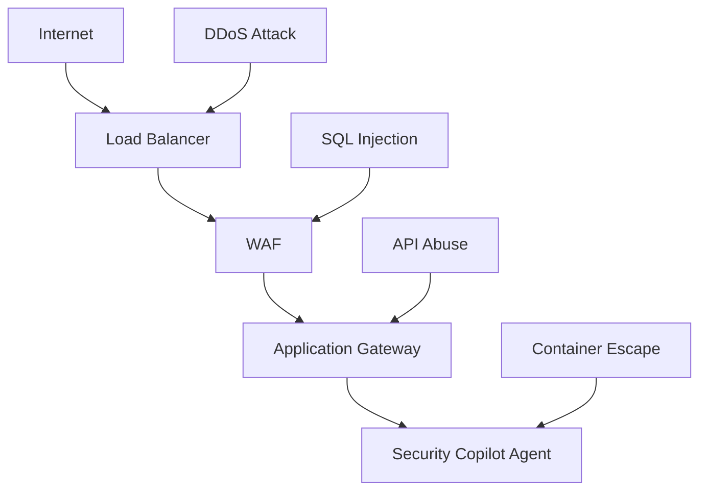

# 🔒 Security Policy - Security Copilot Agent

## Overview

This document outlines the comprehensive security policies, procedures, and guidelines for the Security Copilot Agent project. It covers security requirements, threat model, vulnerability management, and compliance frameworks.

## Table of Contents

- [Security Principles](#security-principles)
- [Threat Model](#threat-model)
- [Security Architecture](#security-architecture)
- [Authentication & Authorization](#authentication--authorization)
- [Data Protection](#data-protection)
- [Vulnerability Management](#vulnerability-management)
- [Incident Response](#incident-response)
- [Compliance](#compliance)
- [Security Testing](#security-testing)
- [Security Monitoring](#security-monitoring)

## Security Principles

### Core Security Tenets

#### 1. Zero Trust Architecture
- **Never Trust, Always Verify**: All network communications and access requests are authenticated and authorized
- **Least Privilege Access**: Users and services receive minimum necessary permissions
- **Continuous Validation**: Real-time verification of security posture and access decisions

#### 2. Defense in Depth
- **Multiple Security Layers**: Redundant security controls at network, application, and data levels
- **Fail-Safe Defaults**: Secure by default configurations with explicit allow lists
- **Compartmentalization**: Isolation of critical components and data

#### 3. Privacy by Design
- **Data Minimization**: Collect and process only necessary security data
- **Purpose Limitation**: Data used only for intended security purposes
- **Transparency**: Clear communication about data collection and usage

#### 4. Continuous Security
- **Real-Time Monitoring**: 24/7 security monitoring and alerting
- **Automated Response**: Immediate response to security threats
- **Regular Assessment**: Periodic security reviews and updates

## Threat Model

### Threat Actors

#### External Threats
- **Cybercriminals**: Financially motivated attackers seeking to exploit vulnerabilities
- **Nation-State Actors**: Advanced persistent threats (APTs) targeting infrastructure
- **Hacktivists**: Ideologically motivated groups targeting organizations
- **Script Kiddies**: Inexperienced attackers using automated tools

#### Internal Threats
- **Malicious Insiders**: Employees with authorized access acting maliciously
- **Negligent Users**: Unintentional security violations due to lack of awareness
- **Compromised Accounts**: Legitimate accounts controlled by external actors
- **Third-Party Vendors**: External partners with system access

### Attack Vectors

#### Network-Based Attacks


#### Application-Level Threats
- **Injection Attacks**: SQL injection, command injection, LDAP injection
- **Authentication Bypass**: Session hijacking, credential stuffing, brute force
- **Authorization Flaws**: Privilege escalation, broken access controls
- **Input Validation**: Cross-site scripting (XSS), cross-site request forgery (CSRF)

#### Infrastructure Threats
- **Cloud Misconfigurations**: Overprivileged IAM roles, open storage buckets
- **Container Vulnerabilities**: Base image vulnerabilities, insecure configurations
- **Supply Chain Attacks**: Compromised dependencies, malicious packages
- **Insider Threats**: Privileged access abuse, data exfiltration

### Risk Assessment Matrix

| Threat | Likelihood | Impact | Risk Level | Mitigation Priority |
|--------|------------|--------|------------|-------------------|
| SQL Injection | Medium | High | High | Critical |
| DDoS Attack | High | Medium | High | Critical |
| Insider Threat | Low | High | Medium | High |
| Supply Chain | Medium | Medium | Medium | High |
| Credential Stuffing | High | Low | Medium | Medium |
| Physical Access | Low | Low | Low | Low |

## Security Architecture

### Security Controls Framework

#### Preventive Controls
```yaml
Network Security:
  - Web Application Firewall (WAF)
  - Network Security Groups (NSGs)
  - Azure Private Link
  - TLS 1.3 encryption
  - Certificate pinning

Application Security:
  - Input validation and sanitization
  - Output encoding
  - Secure coding practices
  - Static application security testing (SAST)
  - Dynamic application security testing (DAST)

Access Controls:
  - Multi-factor authentication (MFA)
  - Role-based access control (RBAC)
  - Privileged access management (PAM)
  - Just-in-time (JIT) access
  - Zero trust network access
```

#### Detective Controls
```yaml
Monitoring & Logging:
  - Security information and event management (SIEM)
  - User and entity behavior analytics (UEBA)
  - Azure Security Center
  - Azure Sentinel
  - Custom security metrics

Vulnerability Assessment:
  - Automated vulnerability scanning
  - Penetration testing
  - Security code reviews
  - Dependency vulnerability scanning
  - Infrastructure as code scanning
```

#### Corrective Controls
```yaml
Incident Response:
  - Automated incident response playbooks
  - Security orchestration, automation and response (SOAR)
  - Threat hunting procedures
  - Forensic analysis capabilities
  - Recovery procedures

Patch Management:
  - Automated security updates
  - Emergency patching procedures
  - Vulnerability remediation workflows
  - Configuration drift detection
  - Rollback capabilities
```

### Secure Development Lifecycle (SDL)

#### Phase 1: Requirements & Design
```yaml
Security Requirements:
  - Threat modeling
  - Security architecture review
  - Privacy impact assessment
  - Compliance requirements analysis
  - Security acceptance criteria

Design Review:
  - Security architecture patterns
  - Secure design principles
  - Attack surface analysis
  - Data flow analysis
  - Trust boundary identification
```

#### Phase 2: Implementation
```yaml
Secure Coding:
  - OWASP Top 10 compliance
  - Secure coding guidelines
  - Input validation framework
  - Authentication and authorization libraries
  - Cryptographic standards

Code Review:
  - Peer code review
  - Static analysis tools
  - Security-focused review checklist
  - Automated security testing
  - Dependency vulnerability scanning
```

#### Phase 3: Testing & Validation
```yaml
Security Testing:
  - Unit tests for security functions
  - Integration security testing
  - Penetration testing
  - Vulnerability assessment
  - Security regression testing

Validation:
  - Security requirements verification
  - Compliance validation
  - Performance security testing
  - User acceptance testing
  - Security sign-off
```

#### Phase 4: Deployment & Operations
```yaml
Secure Deployment:
  - Infrastructure as code security
  - Container security scanning
  - Configuration validation
  - Secrets management
  - Monitoring setup

Operations:
  - Security monitoring
  - Incident response readiness
  - Patch management
  - Regular security assessments
  - Continuous improvement
```

## Authentication & Authorization

### Identity and Access Management (IAM)

#### User Authentication
```yaml
Primary Authentication:
  - Azure Active Directory integration
  - Multi-factor authentication (MFA) required
  - Conditional access policies
  - Risk-based authentication
  - Password policy enforcement

Secondary Authentication:
  - Hardware security keys (FIDO2)
  - Biometric authentication
  - SMS/Voice backup methods
  - App-based authentication
  - Emergency access codes
```

#### Service Authentication
```yaml
Azure Services:
  - Managed Identity (preferred)
  - Service Principal with certificates
  - Azure Key Vault integration
  - Workload Identity Federation
  - Conditional access for services

GitHub Integration:
  - GitHub Apps with minimal permissions
  - Personal Access Tokens (time-limited)
  - OAuth 2.0 with PKCE
  - Webhook signature verification
  - IP allowlist restrictions
```

#### Authorization Model
```yaml
Role-Based Access Control (RBAC):
  Roles:
    - Security Admin: Full system access
    - Security Analyst: Read access + scan execution
    - Viewer: Read-only access to findings
    - API User: Programmatic access
    - Emergency: Break-glass emergency access

  Permissions:
    - scan.create: Trigger security scans
    - scan.read: View scan results
    - findings.read: View security findings
    - findings.update: Update finding status
    - remediation.create: Trigger auto-remediation
    - config.read: View configuration
    - config.update: Modify configuration
    - admin.all: Administrative access

  Resource Scoping:
    - Subscription level
    - Resource group level
    - Individual resource level
    - Finding level
    - Report level
```

### Token Management

#### JWT Token Security
```python
# Example secure JWT configuration
JWT_CONFIG = {
    "algorithm": "RS256",
    "issuer": "https://security-copilot.com",
    "audience": "security-copilot-api",
    "expiration": 3600,  # 1 hour
    "refresh_threshold": 300,  # 5 minutes
    "max_refresh_count": 10,
    "secure_cookies": True,
    "httponly_cookies": True,
    "samesite_strict": True
}

class TokenManager:
    def __init__(self):
        self.private_key = self._load_private_key()
        self.public_key = self._load_public_key()
    
    def create_token(self, user_id, roles, scopes):
        payload = {
            "sub": user_id,
            "iss": JWT_CONFIG["issuer"],
            "aud": JWT_CONFIG["audience"],
            "exp": datetime.utcnow() + timedelta(seconds=JWT_CONFIG["expiration"]),
            "iat": datetime.utcnow(),
            "roles": roles,
            "scopes": scopes,
            "jti": str(uuid.uuid4())  # Unique token ID for revocation
        }
        return jwt.encode(payload, self.private_key, algorithm=JWT_CONFIG["algorithm"])
    
    def validate_token(self, token):
        try:
            payload = jwt.decode(
                token, 
                self.public_key, 
                algorithms=[JWT_CONFIG["algorithm"]],
                issuer=JWT_CONFIG["issuer"],
                audience=JWT_CONFIG["audience"]
            )
            
            # Check if token is revoked
            if self._is_token_revoked(payload["jti"]):
                raise InvalidTokenError("Token has been revoked")
            
            return payload
        except jwt.ExpiredSignatureError:
            raise InvalidTokenError("Token has expired")
        except jwt.InvalidTokenError as e:
            raise InvalidTokenError(f"Invalid token: {str(e)}")
```

## Data Protection

### Data Classification

#### Security Data Categories
```yaml
Highly Sensitive:
  - Azure credentials and secrets
  - GitHub personal access tokens
  - Database connection strings
  - Private keys and certificates
  - User personal information

Sensitive:
  - Security findings and vulnerabilities
  - Azure resource configurations
  - Network security group rules
  - Audit logs and events
  - Performance metrics

Internal:
  - Application configurations
  - Non-sensitive logs
  - Public documentation
  - System status information
  - Anonymized analytics

Public:
  - Product documentation
  - Open source code
  - Public API specifications
  - Marketing materials
  - General support information
```

### Encryption Standards

#### Encryption at Rest
```yaml
Database Encryption:
  - Azure SQL Transparent Data Encryption (TDE)
  - Always Encrypted for sensitive columns
  - Column-level encryption for PII
  - Key rotation every 90 days
  - Customer-managed encryption keys

File System Encryption:
  - AES-256 encryption for all storage
  - Azure Storage Service Encryption
  - BitLocker for VM disks
  - Encrypted container images
  - Secure backup encryption

Key Management:
  - Azure Key Vault HSM
  - Hardware Security Modules (HSM)
  - Key rotation automation
  - Secure key backup and recovery
  - Multi-region key replication
```

#### Encryption in Transit
```yaml
Network Encryption:
  - TLS 1.3 for all external communications
  - Certificate pinning for API calls
  - Perfect Forward Secrecy (PFS)
  - HSTS headers enforced
  - Certificate transparency monitoring

Internal Communications:
  - mTLS for service-to-service communication
  - VPN for administrative access
  - Azure Private Link for Azure services
  - Encrypted container networking
  - Secure service mesh implementation
```

### Data Loss Prevention (DLP)

#### Data Handling Policies
```yaml
Data Retention:
  - Security findings: 7 years
  - Audit logs: 5 years
  - Performance metrics: 2 years
  - Debug logs: 30 days
  - Temporary files: 24 hours

Data Sharing:
  - No sharing of sensitive data outside authorized systems
  - Encrypted channels for all data transfers
  - Data anonymization for analytics
  - Audit trail for all data access
  - Regular access reviews

Data Disposal:
  - Cryptographic erasure for cloud storage
  - Secure wipe for physical media
  - Certificate of destruction for hardware
  - Verification of data deletion
  - Audit trail of disposal activities
```

## Vulnerability Management

### Vulnerability Assessment Process

#### Continuous Scanning
```yaml
Automated Scanning:
  Schedule:
    - Infrastructure scan: Daily
    - Application scan: On every deployment
    - Dependency scan: On code commit
    - Container scan: On image build
    - Configuration scan: Hourly

  Tools:
    - Azure Security Center
    - Qualys VMDR
    - OWASP ZAP
    - Snyk for dependencies
    - Trivy for containers
    - Custom security rules

  Coverage:
    - Network infrastructure
    - Application code
    - Third-party dependencies
    - Container images
    - Configuration files
    - Cloud resources
```

#### Vulnerability Prioritization
```yaml
Risk Scoring:
  Factors:
    - CVSS base score (40%)
    - Exploitability score (25%)
    - Asset criticality (20%)
    - Threat intelligence (10%)
    - Business impact (5%)

  Priority Levels:
    Critical (9.0-10.0):
      - SLA: 24 hours
      - Notification: Immediate alert
      - Escalation: CISO notification
      - Response: Emergency patching

    High (7.0-8.9):
      - SLA: 72 hours
      - Notification: Daily digest
      - Escalation: Security team lead
      - Response: Scheduled patching

    Medium (4.0-6.9):
      - SLA: 14 days
      - Notification: Weekly report
      - Escalation: Security analyst
      - Response: Regular maintenance

    Low (0.1-3.9):
      - SLA: 30 days
      - Notification: Monthly report
      - Escalation: None
      - Response: Planned updates
```

### Patch Management

#### Emergency Patching Process
```python
class EmergencyPatchManager:
    def __init__(self):
        self.notification_service = NotificationService()
        self.deployment_service = DeploymentService()
        self.rollback_service = RollbackService()
    
    async def handle_critical_vulnerability(self, vulnerability):
        """Handle critical vulnerability requiring emergency patch"""
        
        # Immediate notification
        await self.notification_service.send_alert(
            severity="CRITICAL",
            message=f"Critical vulnerability detected: {vulnerability.cve_id}",
            recipients=["security-team", "ciso", "incident-response"]
        )
        
        # Assess impact
        impact_assessment = await self.assess_impact(vulnerability)
        
        if impact_assessment.requires_immediate_action:
            # Create emergency patch
            patch = await self.create_emergency_patch(vulnerability)
            
            # Deploy to staging first
            staging_result = await self.deployment_service.deploy_to_staging(patch)
            
            if staging_result.success:
                # Get approval for production deployment
                approval = await self.request_emergency_approval(vulnerability, patch)
                
                if approval.approved:
                    # Deploy to production with monitoring
                    production_result = await self.deployment_service.deploy_to_production(
                        patch, 
                        monitoring=True,
                        rollback_on_failure=True
                    )
                    
                    # Monitor for issues
                    await self.monitor_post_deployment(patch, duration=timedelta(hours=2))
                else:
                    # Implement temporary mitigations
                    await self.implement_temporary_mitigations(vulnerability)
    
    async def assess_impact(self, vulnerability):
        """Assess the impact of a vulnerability on our systems"""
        affected_components = []
        
        # Check if vulnerability affects our dependencies
        for dependency in self.get_dependencies():
            if vulnerability.affects_component(dependency):
                affected_components.append(dependency)
        
        # Check direct code impact
        code_impact = await self.scan_codebase_for_vulnerability(vulnerability)
        
        return ImpactAssessment(
            affected_components=affected_components,
            code_impact=code_impact,
            risk_score=vulnerability.calculate_risk_score(),
            requires_immediate_action=vulnerability.cvss_score >= 9.0
        )
```

## Incident Response

### Incident Classification

#### Severity Levels
```yaml
Severity 1 (Critical):
  Criteria:
    - Active exploitation detected
    - Data breach confirmed
    - System completely unavailable
    - Critical vulnerability publicly disclosed
  
  Response Time: 15 minutes
  Escalation: CISO, CTO, Legal
  Communication: Hourly updates
  
  Example Scenarios:
    - Unauthorized access to production database
    - DDoS attack causing service outage
    - Malware infection spreading across systems
    - Zero-day exploit in critical component

Severity 2 (High):
  Criteria:
    - Potential security breach
    - Significant service degradation
    - High-risk vulnerability identified
    - Suspicious activity detected
  
  Response Time: 1 hour
  Escalation: Security team lead
  Communication: Every 4 hours
  
  Example Scenarios:
    - Failed login attempts spike
    - Unusual network traffic patterns
    - Security tool alerts on potential threat
    - Configuration drift detected

Severity 3 (Medium):
  Criteria:
    - Minor security concern
    - Limited service impact
    - Medium-risk vulnerability
    - Policy violation detected
  
  Response Time: 4 hours
  Escalation: Security analyst
  Communication: Daily updates
  
  Example Scenarios:
    - Single failed security scan
    - Non-critical service degradation
    - User account locked due to policy
    - Minor configuration issue

Severity 4 (Low):
  Criteria:
    - Informational security event
    - No immediate impact
    - Low-risk finding
    - Routine security activity
  
  Response Time: 24 hours
  Escalation: None
  Communication: Weekly summary
```

### Incident Response Playbooks

#### Data Breach Response
```yaml
Phase 1: Detection and Analysis (0-1 hour)
  1. Confirm incident is genuine security breach
  2. Determine scope and impact of breach
  3. Identify compromised systems and data
  4. Preserve evidence for forensic analysis
  5. Activate incident response team

Phase 2: Containment (1-4 hours)
  1. Isolate affected systems
  2. Disable compromised accounts
  3. Apply temporary security controls
  4. Prevent further data exfiltration
  5. Document all actions taken

Phase 3: Eradication (4-24 hours)
  1. Remove malware and unauthorized access
  2. Patch vulnerabilities exploited
  3. Strengthen security controls
  4. Update security configurations
  5. Verify threat elimination

Phase 4: Recovery (1-7 days)
  1. Restore systems from clean backups
  2. Implement additional monitoring
  3. Gradually restore normal operations
  4. Validate system integrity
  5. Monitor for recurrence

Phase 5: Lessons Learned (7-30 days)
  1. Document incident timeline
  2. Identify root causes
  3. Update security controls
  4. Improve detection capabilities
  5. Update incident response procedures
```

#### Automated Response Actions
```python
class IncidentResponseAutomation:
    def __init__(self):
        self.azure_client = AzureSecurityClient()
        self.github_client = GitHubClient()
        self.notification_service = NotificationService()
    
    async def handle_critical_finding(self, finding):
        """Automated response to critical security findings"""
        
        # Immediate containment actions
        containment_actions = []
        
        if finding.type == "UNRESTRICTED_SSH_RDP":
            # Temporarily disable the NSG rule
            action = await self.azure_client.disable_nsg_rule(
                resource_group=finding.resource_group,
                nsg_name=finding.nsg_name,
                rule_name=finding.rule_name
            )
            containment_actions.append(action)
        
        elif finding.type == "OPEN_TO_INTERNET":
            # Restrict source to internal networks only
            action = await self.azure_client.update_nsg_rule_source(
                resource_group=finding.resource_group,
                nsg_name=finding.nsg_name,
                rule_name=finding.rule_name,
                new_source="10.0.0.0/8"  # Internal networks only
            )
            containment_actions.append(action)
        
        # Create emergency GitHub issue
        issue = await self.github_client.create_emergency_issue(
            title=f"CRITICAL: {finding.title}",
            body=self._generate_emergency_issue_body(finding, containment_actions),
            labels=["critical", "security", "emergency"],
            assignees=["security-team"]
        )
        
        # Send immediate notifications
        await self.notification_service.send_critical_alert(
            finding=finding,
            containment_actions=containment_actions,
            github_issue=issue
        )
        
        # Log incident for audit trail
        await self.log_security_incident(
            finding=finding,
            response_actions=containment_actions,
            timestamp=datetime.utcnow()
        )
```

## Compliance

### Regulatory Frameworks

#### SOC 2 Type II Compliance
```yaml
Trust Service Criteria:
  
  Security (CC6.0):
    - Access controls and authentication
    - Logical and physical access restrictions
    - System boundaries and network segmentation
    - Data transmission and disposal
    - Security monitoring and incident response
  
  Availability (CC7.0):
    - System monitoring and capacity planning
    - Backup and disaster recovery procedures
    - Change management processes
    - System resilience and redundancy
    - Performance monitoring and optimization
  
  Processing Integrity (CC8.0):
    - Data input validation and processing
    - Error handling and exception management
    - Data quality monitoring and verification
    - System interfaces and data transfers
    - Processing completeness and accuracy
  
  Confidentiality (CC9.0):
    - Data classification and handling
    - Encryption and key management
    - Access restrictions and monitoring
    - Data retention and disposal
    - Third-party data sharing agreements
  
  Privacy (CC10.0):
    - Privacy notice and consent management
    - Data collection limitation and purpose specification
    - Data quality and retention management
    - Data subject access and correction rights
    - Privacy breach notification procedures

Controls Implementation:
  - Automated access reviews (quarterly)
  - Encryption key rotation (90 days)
  - Vulnerability assessments (monthly)
  - Penetration testing (annually)
  - Security awareness training (ongoing)
```

#### PCI DSS Compliance
```yaml
Requirements:
  
  1. Firewall Configuration:
     - Network security groups properly configured
     - Default deny policies implemented
     - Firewall rules documented and reviewed
     - Remote access through secure VPN only
  
  2. Default Passwords:
     - All default passwords changed
     - Strong password policies enforced
     - Multi-factor authentication required
     - Regular password rotation mandated
  
  3. Cardholder Data Protection:
     - Data encryption at rest and in transit
     - Data retention policies enforced
     - Secure data disposal procedures
     - Limited data storage and access
  
  4. Encrypted Transmission:
     - TLS 1.3 for all transmissions
     - Certificate management program
     - Secure key exchange protocols
     - Network traffic monitoring
  
  5. Antivirus Protection:
     - Endpoint protection deployed
     - Container security scanning
     - Malware detection and prevention
     - Regular security updates
  
  6. Secure Systems:
     - Security patches applied promptly
     - Secure configuration standards
     - Change management procedures
     - System hardening guidelines
  
  7. Access Restrictions:
     - Role-based access controls
     - Least privilege principle
     - Need-to-know access limitations
     - Regular access reviews
  
  8. Unique User IDs:
     - Individual user accounts required
     - Shared accounts prohibited
     - User identification and authentication
     - Account lifecycle management
  
  9. Physical Access:
     - Cloud provider security controls
     - Data center access restrictions
     - Physical security monitoring
     - Asset inventory and tracking
  
  10. Network Monitoring:
      - Continuous network monitoring
      - Log aggregation and analysis
      - Intrusion detection systems
      - Security event correlation
  
  11. Security Testing:
      - Regular vulnerability scans
      - Penetration testing program
      - Security code reviews
      - Network segmentation testing
  
  12. Information Security Policy:
      - Comprehensive security policies
      - Regular policy updates
      - Security awareness training
      - Incident response procedures
```

### Audit and Compliance Monitoring

#### Automated Compliance Checking
```python
class ComplianceMonitor:
    def __init__(self):
        self.azure_client = AzureClient()
        self.compliance_rules = self._load_compliance_rules()
        self.audit_logger = AuditLogger()
    
    async def run_compliance_check(self, framework="SOC2"):
        """Run comprehensive compliance check"""
        
        results = ComplianceResults(framework=framework)
        
        for rule in self.compliance_rules[framework]:
            try:
                # Execute compliance rule
                rule_result = await self._execute_compliance_rule(rule)
                results.add_result(rule_result)
                
                # Log compliance check
                await self.audit_logger.log_compliance_check(
                    rule=rule,
                    result=rule_result,
                    timestamp=datetime.utcnow()
                )
                
                # Alert on non-compliance
                if rule_result.status == "NON_COMPLIANT":
                    await self._handle_non_compliance(rule, rule_result)
                    
            except Exception as e:
                # Log compliance check failure
                await self.audit_logger.log_compliance_error(
                    rule=rule,
                    error=str(e),
                    timestamp=datetime.utcnow()
                )
        
        # Generate compliance report
        report = await self._generate_compliance_report(results)
        return report
    
    async def _execute_compliance_rule(self, rule):
        """Execute a specific compliance rule"""
        
        if rule.type == "azure_nsg_check":
            return await self._check_nsg_compliance(rule)
        elif rule.type == "encryption_check":
            return await self._check_encryption_compliance(rule)
        elif rule.type == "access_control_check":
            return await self._check_access_control_compliance(rule)
        else:
            raise ValueError(f"Unknown compliance rule type: {rule.type}")
    
    async def _check_encryption_compliance(self, rule):
        """Check encryption compliance requirements"""
        
        results = []
        
        # Check database encryption
        databases = await self.azure_client.list_sql_databases()
        for db in databases:
            tde_enabled = await self.azure_client.is_tde_enabled(db)
            results.append({
                "resource": db.name,
                "requirement": "TDE encryption enabled",
                "compliant": tde_enabled,
                "details": f"TDE status: {'Enabled' if tde_enabled else 'Disabled'}"
            })
        
        # Check storage encryption
        storage_accounts = await self.azure_client.list_storage_accounts()
        for storage in storage_accounts:
            encryption_enabled = await self.azure_client.is_storage_encrypted(storage)
            results.append({
                "resource": storage.name,
                "requirement": "Storage encryption enabled",
                "compliant": encryption_enabled,
                "details": f"Encryption: {'Enabled' if encryption_enabled else 'Disabled'}"
            })
        
        compliance_percentage = sum(1 for r in results if r["compliant"]) / len(results) * 100
        
        return ComplianceRuleResult(
            rule_id=rule.id,
            status="COMPLIANT" if compliance_percentage >= rule.threshold else "NON_COMPLIANT",
            compliance_percentage=compliance_percentage,
            details=results
        )
```

## Security Testing

### Testing Strategy

#### Security Testing Types
```yaml
Static Application Security Testing (SAST):
  Tools:
    - SonarQube Security Hotspots
    - CodeQL (GitHub Advanced Security)
    - Bandit (Python security linter)
    - ESLint security plugin
    - Custom security rules
  
  Coverage:
    - SQL injection vulnerabilities
    - Cross-site scripting (XSS)
    - Authentication bypass
    - Authorization flaws
    - Input validation issues
    - Cryptographic weaknesses
  
  Integration:
    - Pre-commit hooks
    - Pull request checks
    - CI/CD pipeline gates
    - IDE extensions
    - Regular scheduled scans

Dynamic Application Security Testing (DAST):
  Tools:
    - OWASP ZAP
    - Burp Suite Professional
    - Netsparker
    - Acunetix
    - Custom security tests
  
  Coverage:
    - Authentication mechanisms
    - Session management
    - Input validation
    - Error handling
    - Configuration issues
    - Business logic flaws
  
  Scenarios:
    - Unauthenticated access attempts
    - Privilege escalation tests
    - Data injection attacks
    - Session hijacking attempts
    - API security testing

Interactive Application Security Testing (IAST):
  Implementation:
    - Runtime application monitoring
    - Real-time vulnerability detection
    - Code coverage analysis
    - Performance impact assessment
    - False positive reduction
  
  Benefits:
    - Accurate vulnerability detection
    - Minimal false positives
    - Real-time feedback
    - Development-friendly integration
    - Comprehensive test coverage

Penetration Testing:
  Methodology:
    - OWASP Testing Guide
    - NIST SP 800-115
    - PTES (Penetration Testing Execution Standard)
    - Custom security scenarios
    - Red team exercises
  
  Scope:
    - External network perimeter
    - Web application security
    - API security assessment
    - Cloud infrastructure security
    - Social engineering resistance
  
  Frequency:
    - Annual comprehensive assessment
    - Quarterly focused testing
    - Post-major release testing
    - Incident-driven testing
    - Continuous automated testing
```

### Security Test Automation

#### Automated Security Testing Pipeline
```yaml
# .github/workflows/security-testing.yml
name: Security Testing Pipeline

on:
  push:
    branches: [main, develop]
  pull_request:
    branches: [main]
  schedule:
    - cron: '0 2 * * 0'  # Weekly security scan

jobs:
  secret-scanning:
    runs-on: ubuntu-latest
    steps:
    - uses: actions/checkout@v4
      with:
        fetch-depth: 0
    
    - name: Run TruffleHog
      uses: trufflesecurity/trufflehog@main
      with:
        path: ./
        base: main
        head: HEAD
        extra_args: --debug --only-verified

  static-analysis:
    runs-on: ubuntu-latest
    steps:
    - uses: actions/checkout@v4
    
    - name: Set up Python
      uses: actions/setup-python@v4
      with:
        python-version: '3.11'
    
    - name: Install dependencies
      run: |
        pip install bandit[toml] safety semgrep
    
    - name: Run Bandit
      run: |
        bandit -r security_copilot/ -f json -o bandit-report.json
    
    - name: Run Safety
      run: |
        safety check --json --output safety-report.json
    
    - name: Run Semgrep
      env:
        SEMGREP_APP_TOKEN: ${{ secrets.SEMGREP_APP_TOKEN }}
      run: |
        semgrep --config=auto --json --output=semgrep-report.json

  dynamic-analysis:
    runs-on: ubuntu-latest
    services:
      postgres:
        image: postgres:13
        env:
          POSTGRES_PASSWORD: postgres
        options: >-
          --health-cmd pg_isready
          --health-interval 10s
          --health-timeout 5s
          --health-retries 5
    
    steps:
    - uses: actions/checkout@v4
    
    - name: Build application
      run: |
        docker build -t security-copilot:test .
    
    - name: Run application
      run: |
        docker run -d -p 8080:8080 --name test-app security-copilot:test
        sleep 30  # Wait for app to start
    
    - name: Run OWASP ZAP Scan
      uses: zaproxy/action-full-scan@v0.4.0
      with:
        target: 'http://localhost:8080'
        rules_file_name: '.zap/rules.tsv'
        cmd_options: '-a'

  container-security:
    runs-on: ubuntu-latest
    steps:
    - uses: actions/checkout@v4
    
    - name: Build image
      run: docker build -t security-copilot:test .
    
    - name: Run Trivy vulnerability scanner
      uses: aquasecurity/trivy-action@master
      with:
        image-ref: 'security-copilot:test'
        format: 'sarif'
        output: 'trivy-results.sarif'
    
    - name: Upload Trivy scan results
      uses: github/codeql-action/upload-sarif@v2
      with:
        sarif_file: 'trivy-results.sarif'

  infrastructure-security:
    runs-on: ubuntu-latest
    steps:
    - uses: actions/checkout@v4
    
    - name: Run Checkov
      uses: bridgecrewio/checkov-action@master
      with:
        directory: .
        framework: terraform,dockerfile,kubernetes
        output_format: sarif
        output_file_path: checkov-results.sarif
    
    - name: Upload Checkov scan results
      uses: github/codeql-action/upload-sarif@v2
      with:
        sarif_file: checkov-results.sarif
```

## Security Monitoring

### Security Operations Center (SOC) Integration

#### 24/7 Security Monitoring
```yaml
Monitoring Capabilities:
  
  Real-Time Threat Detection:
    - Azure Sentinel SIEM integration
    - Custom detection rules
    - Machine learning anomaly detection
    - Threat intelligence correlation
    - Behavioral analysis
  
  Security Metrics:
    - Failed authentication attempts
    - Privileged account usage
    - Data access patterns
    - Network traffic anomalies
    - Application performance indicators
  
  Alerting Framework:
    - Severity-based escalation
    - Multi-channel notifications
    - Alert correlation and suppression
    - Automated response triggers
    - Management dashboards

Alert Categories:
  
  Critical Alerts (Immediate Response):
    - Active security breach
    - Critical vulnerability exploitation
    - Unauthorized admin access
    - Data exfiltration detected
    - System compromise indicators
  
  High Priority Alerts (1-hour response):
    - Suspicious login patterns
    - Unusual data access
    - Security policy violations
    - Failed security scans
    - Configuration drift
  
  Medium Priority Alerts (4-hour response):
    - Performance degradation
    - Minor policy violations
    - Routine security events
    - System health warnings
    - Capacity threshold alerts
  
  Informational Alerts (Daily review):
    - Successful security operations
    - System status updates
    - Scheduled maintenance events
    - Performance metrics
    - User activity summaries
```

#### Security Incident Response Integration
```python
class SecurityMonitor:
    def __init__(self):
        self.sentinel_client = AzureSentinelClient()
        self.incident_manager = IncidentManager()
        self.notification_service = NotificationService()
        self.threat_intel = ThreatIntelligenceService()
    
    async def monitor_security_events(self):
        """Continuous security monitoring and response"""
        
        while True:
            try:
                # Query security events from Sentinel
                events = await self.sentinel_client.query_security_events(
                    time_range=timedelta(minutes=5),
                    severity=["High", "Critical"]
                )
                
                for event in events:
                    # Enrich event with threat intelligence
                    enriched_event = await self.threat_intel.enrich_event(event)
                    
                    # Analyze event for incident classification
                    incident_classification = await self.analyze_event(enriched_event)
                    
                    if incident_classification.requires_incident:
                        # Create security incident
                        incident = await self.incident_manager.create_incident(
                            event=enriched_event,
                            classification=incident_classification
                        )
                        
                        # Trigger automated response
                        await self.trigger_automated_response(incident)
                        
                        # Send notifications
                        await self.notification_service.send_incident_notification(incident)
                
                # Wait before next monitoring cycle
                await asyncio.sleep(60)  # 1-minute monitoring cycle
                
            except Exception as e:
                logging.error(f"Security monitoring error: {e}")
                await self.notification_service.send_monitoring_error_alert(e)
                await asyncio.sleep(300)  # 5-minute delay on error
    
    async def analyze_event(self, event):
        """Analyze security event to determine incident classification"""
        
        classification = IncidentClassification()
        
        # Check for known attack patterns
        if await self.threat_intel.is_known_attack_pattern(event):
            classification.severity = "Critical"
            classification.requires_incident = True
            classification.automated_response = True
        
        # Check for anomalous behavior
        elif await self.is_anomalous_behavior(event):
            classification.severity = "High"
            classification.requires_incident = True
            classification.automated_response = False
        
        # Check for policy violations
        elif await self.is_policy_violation(event):
            classification.severity = "Medium"
            classification.requires_incident = False
            classification.automated_response = True
        
        return classification
    
    async def trigger_automated_response(self, incident):
        """Trigger automated incident response actions"""
        
        response_actions = []
        
        if incident.type == "UNAUTHORIZED_ACCESS":
            # Disable compromised account
            await self.azure_client.disable_user_account(incident.user_id)
            response_actions.append("Disabled compromised user account")
            
            # Force password reset
            await self.azure_client.force_password_reset(incident.user_id)
            response_actions.append("Forced password reset")
        
        elif incident.type == "MALICIOUS_NETWORK_ACTIVITY":
            # Block malicious IP
            await self.azure_client.add_ip_to_blocklist(incident.source_ip)
            response_actions.append(f"Blocked IP address: {incident.source_ip}")
            
            # Update firewall rules
            await self.azure_client.update_firewall_rules(incident.source_ip)
            response_actions.append("Updated firewall rules")
        
        elif incident.type == "DATA_EXFILTRATION":
            # Temporarily disable data access
            await self.azure_client.revoke_data_access_permissions(incident.user_id)
            response_actions.append("Revoked data access permissions")
            
            # Enable enhanced monitoring
            await self.enable_enhanced_monitoring(incident.user_id)
            response_actions.append("Enabled enhanced user monitoring")
        
        # Log response actions
        await self.incident_manager.log_response_actions(incident.id, response_actions)
        
        return response_actions
```

---

## Security Policy Compliance

### Policy Review and Updates

This security policy is reviewed and updated:
- **Quarterly**: Regular review and minor updates
- **Annually**: Comprehensive review and major updates
- **As Needed**: Emergency updates for new threats or compliance requirements
- **Post-Incident**: Updates based on lessons learned from security incidents

### Policy Acknowledgment

All team members must acknowledge understanding and agreement to follow this security policy. Violations may result in disciplinary action up to and including termination.

### Contact Information

For security policy questions or clarifications:
- **Security Team**: security@security-copilot.com
- **CISO**: ciso@security-copilot.com
- **Privacy Officer**: privacy@security-copilot.com
- **Compliance Team**: compliance@security-copilot.com

---

**Document Version**: 1.0  
**Last Updated**: August 5, 2025  
**Next Review Date**: November 5, 2025  
**Document Owner**: Chief Information Security Officer (CISO)
